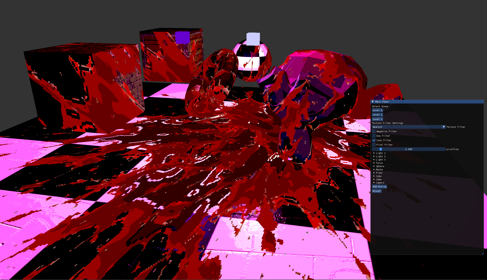

# Toaster 3D engine

This is a tiny little OpenGL 3D engine learning project.
Written in C# with OpenTK and ImGuiNet,

Currently supports:
- Blinn-Phong shading with multiple light sources.
- Point lights, spotlights and directional light sources.
- Diffuse, specular and normal maps.
- Loading .obj files with Assimp.
- Exstensible entities with a Unity-style Entity Component Pattern (Not Quite an ECS though).
- Viewing Multiple scenes.
- Multiple post processing shaders.
- Shooting bloodsplatter decals.
- ImGui.NET UI

<figure>
    
    <figcaption>This is a beautiful scenery.</figcaption>
</figure>

